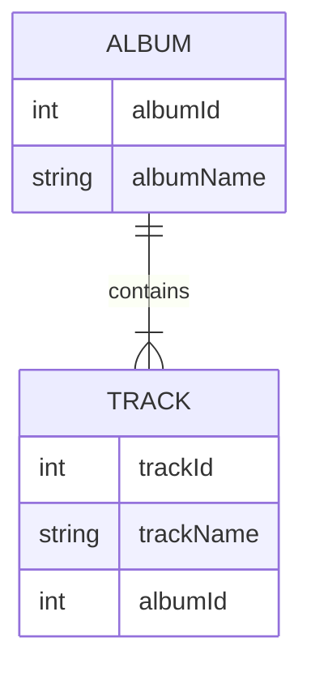

Data replicator could synchronize your data in NDJSON files (data archives) with real database. It preserves relationships. Synchronization is one-way, from data archive data  into database.

Data replicator is executed from [Data deployer](data-deployer)

### What means to preserve relationship?

References are defined by foreign and primary keys. These values could be different in database and in archive, but replicator could preserve relationships between entities.

We will show this on two related tables - Album and Track.

Album table looks like following. When inserting into database, albumId=1 is already occupied, so replicator chooses the first free ID, which is 11 in this sample:
| albumId - archive    | albumId - database | albumName |
| ----------- | ----------- | ----------- |
| 1      | 11 | A Hard Day's Night       |
| 2   | 12| Yellow Submarine        |

Track table has reference to album, so it must use real IDs (11, 12) used in database instead of ids saved in NDJSON file (1,2). For simplicity, we assume, that trackId the same in both database and archive.

| trackId | albumId - archive    | albumId - database | albumName |
| ----------- | ----------- | ----------- | ----------- |
| 21 | 1      | 11 | A Hard Day's Night       |
| 22 | 2   | 12| If I fell        |

Per table settings
- Key (match columns) - this setting is shared with data deployer compare, it defines unique combination of columns used for matching entity
- Find existing row - check if you want to find existing row in database. If not checked, only operation possible will be to create new row everytime
  - Find condition - define condition, only rows matching this condition will be searched in database
- Update existing row - available only if "Find existing row" is checked. Check if you want to update found row with values from archive
  - Update condition - define condition, only rows matching this condition will be updated
- Delete missing row - available only if "Find existing row" is checked. Check if you want to delete rows, which are not in archive
  - Restriction columns - only rows with column values from archive will be deleted
- Create new row - creates new row, if no existing row was found
  - Create condition - define condition, only rows matching this condition will be created in database

